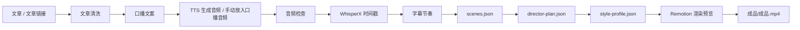

# Shin-video 总导演

把一篇文章变成一条带口播、字幕、导演镜头设计和 Remotion MG 动画的本地视频生成工作流入口。

用户侧只需要理解一句话：

```text
给文章，确认口播，放入口播音频，Agent 自动生成视频。
```


## 它解决什么问题

Shin-video 面向「文章转口播视频」场景：你给 Agent 一篇文章或文章链接，Agent 先整理成可念的口播文案，再根据音频生成时间轴、字幕节奏、导演方案、视觉风格和 Remotion 视频。

它不是专业剪辑软件，也不是项目管理后台。它的目标是让新手不用学习 WhisperX、Remotion、字幕轴、分镜和动效参数，也能按固定流程产出一条可预览、可导出的 MP4。

## 核心管线



最终用户看到的是：

```text
第一步：把文章或文章链接发给 Agent
第二步：确认 Agent 生成的口播文案
第三步：把生成好的口播音频交给 Agent
第四步：确认视觉风格和视频比例
第五步：等待视频生成
```

## 为什么不是 PPT 式视频

Shin-video 的关键设计不是「给每段字幕套一个卡片模板」，而是把视频拆成两层：

```text
director-plan.json  负责导演层：叙事结构、节奏曲线、镜头类型、重点段落、字幕安全区
style-profile.json  负责视觉层：主题色、字体、背景、动效模块、转场、卡片质感
```

这两个文件共同约束 Remotion 模板：

- 同一条视频保持统一视觉主题，但每个段落可以使用不同镜头语言。
- 主画面只负责解释、强化、可视化，不重复完整字幕。
- 字幕跟随音频时间轴，放在安全区，不压住主体画面。
- 数据段、时间线、关系图、价格冲击、总结段要使用不同画面功能。
- Remotion 模板必须读取 `director-plan.json` 和 `style-profile.json`，否则反模板化设计不会生效。

## 安装

这个仓库是 **总控入口包**，负责判断材料状态和调度工作流。它不是完整工作流包，单独安装它只能得到入口调度能力。

如果你要完整运行 Shin-video，需要同时安装下面 10 个子 Skill：

```bash
npx skills add https://github.com/Shinchan-crayon/web-article-cleaner
npx skills add https://github.com/Shinchan-crayon/voiceover-writer
npx skills add https://github.com/Shinchan-crayon/audio-checker
npx skills add https://github.com/Shinchan-crayon/whisperx-transcriber
npx skills add https://github.com/Shinchan-crayon/scene-generator
npx skills add https://github.com/Shinchan-crayon/subtitle-rhythm-builder
npx skills add https://github.com/Shinchan-crayon/remotion-video-director
npx skills add https://github.com/Shinchan-crayon/style-consultant
npx skills add https://github.com/Shinchan-crayon/animation-preset-builder
npx skills add https://github.com/Shinchan-crayon/remotion-renderer
```

最后再安装总控入口：

```bash
npx skills add https://github.com/Shinchan-crayon/shin-video-director
```

如果你拿到的是完整工作流包，优先按 `workflow-manifest.json` 和 `AGENT-先读我.md` 安装，不要只装总控入口。

## 前置依赖

运行完整链路前，建议先准备好这些环境：

```text
Node.js + npm        用于运行 Remotion 项目和前端工具
Python 3            用于 WhisperX / faster-whisper 相关脚本
FFmpeg              用于音频检查、转码、视频合成
WhisperX            用于从口播音频生成时间戳
faster-whisper      用于本地语音识别模型能力
Remotion            用于 React 视频模板渲染
MiniMax API Key     可选，用于 speech-2.8-hd 自动生成口播音频
```

MiniMax 不可用时，不要卡死整条线。用户可以手动提供 `口播音频.mp3`，然后继续执行音频检查、WhisperX 时间戳、导演方案和 Remotion 渲染。

本仓库只保存 Skill 说明，不保存你的 API Key。请把密钥放到本地运行项目的 `.env.local` 或 Agent 指定的安全配置里，不要提交到 GitHub。

更细的新手安装说明见：

- `references/前期准备说明.md`
- `references/新手小白安装与制作教程.md`
- `references/WhisperX和Remotion部署说明.md`

## 使用方式

安装后，向 Agent 说明你要使用「Shin-video 总导演」即可。

示例：

```text
请使用 Shin-video 总导演，继续处理当前 Shin-video 项目。
```

常见输入方式：

```text
我发你一篇文章，请先改成 300 字口播文案。
```

```text
口播文案确认，继续生成音频。
```

```text
音频已经放到口播音频.mp3，继续生成时间戳和视频。
```

## 运行产物

Shin-video v1 的统一输出规范是：

```text
文章正文.md
口播文案.md
口播音频.mp3
runtime/asr.json
runtime/scenes.json
runtime/director-plan.json
runtime/style-profile.json
runtime/preview.mp4
成品/成品.mp4
```

其中：

- `runtime/asr.json`：音频识别和时间戳结果。
- `runtime/scenes.json`：按时间轴切分的字幕和场景基础数据。
- `runtime/director-plan.json`：导演级镜头、节奏、重点段落和安全区设计。
- `runtime/style-profile.json`：视觉主题、动效模块、转场和 Remotion 渲染配置。
- `runtime/preview.mp4`：预览视频。
- `成品/成品.mp4`：最终交付视频。

## 能力边界

- v1 默认处理纯文章自然语言，生成 MG 动画口播视频。
- v1 不把图片素材作为必要步骤，图片只作为可选增强。
- v1 不做网站、账号、历史记录、项目管理和仪表盘。
- 口播文案只能包含要念出来的话，不能混入分镜说明或 Remotion 指令。
- 不能跳过 WhisperX 时间戳步骤。
- 不能跳过 `runtime/director-plan.json` 和 `runtime/style-profile.json`。
- 最终成片固定输出到 `成品/成品.mp4`。
- 视频质量最终取决于本地 Remotion 模板是否真正读取并执行 `director-plan.json` 和 `style-profile.json`。

## 总控包职责

`shin-video-director` 只负责判断用户当前给了什么材料，并调度对应子 Skill：

```text
用户只给文章       -> 文章清洗 + 口播文案
用户确认口播文案   -> 音频生成 / 等待用户放入口播音频
用户已放入口播音频 -> 音频检查 + WhisperX 时间戳
时间戳完成         -> 场景生成 + 字幕节奏 + 导演方案
渲染前             -> 询问视觉风格和视频比例
风格确认后         -> 视觉预设 + Remotion 渲染 + 导出 MP4
```

真正干活的是子 Skill 和本地 Shin-video 运行项目。总控包的价值是保证流程不漏步骤，尤其是不跳过时间戳、导演方案、视觉风格确认和最终渲染检查。
